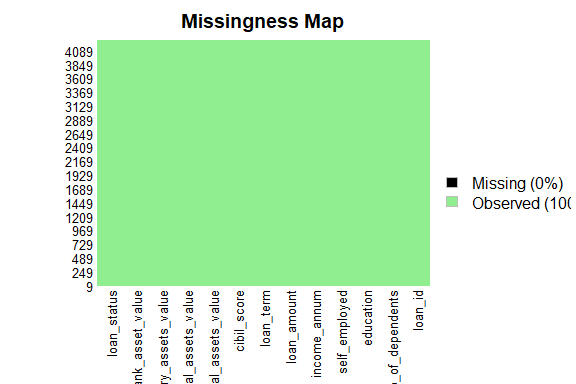

Business Intelligence Project
================
<Ayan Ahmed>
\<17th November\>

- [Student Details](#student-details)

# Student Details

|                       |              |
|-----------------------|--------------|
| **Student ID Number** | 127039 …     |
| **Student Name**      | Ayan Ahmed … |
| **BBIT 4.2 Group**    | .C..         |

\#Loading dataset

``` r
library(readr)
loan_dataset <- read_csv("Data/loan_dataset.csv")
```

    ## Rows: 4269 Columns: 13
    ## ── Column specification ────────────────────────────────────────────────────────
    ## Delimiter: ","
    ## chr  (3): education, self_employed, loan_status
    ## dbl (10): loan_id, no_of_dependents, income_annum, loan_amount, loan_term, c...
    ## 
    ## ℹ Use `spec()` to retrieve the full column specification for this data.
    ## ℹ Specify the column types or set `show_col_types = FALSE` to quiet this message.

``` r
View(loan_dataset)
```

\#installing packages

``` r
if (!is.element("renv", installed.packages()[, 1])) {
  install.packages("renv", dependencies = TRUE)
}
require("renv")
```

    ## Loading required package: renv

    ## 
    ## Attaching package: 'renv'

    ## The following objects are masked from 'package:stats':
    ## 
    ##     embed, update

    ## The following objects are masked from 'package:utils':
    ## 
    ##     history, upgrade

    ## The following objects are masked from 'package:base':
    ## 
    ##     autoload, load, remove

``` r
renv::init()
```

    ## - Linking packages into the project library ... [35/136] [36/136] [37/136] [38/136] [39/136] [40/136] [41/136] [42/136] [43/136] [44/136] [45/136] [46/136] [47/136] [48/136] [49/136] [50/136] [51/136] [52/136] [53/136] [54/136] [55/136] [56/136] [57/136] [58/136] [59/136] [60/136] [61/136] [62/136] [63/136] [64/136] [65/136] [66/136] [67/136] [68/136] [69/136] [70/136] [71/136] [72/136] [73/136] [74/136] [75/136] [76/136] [77/136] [78/136] [79/136] [80/136] [81/136] [82/136] [83/136] [84/136] [85/136] [86/136] [87/136] [88/136] [89/136] [90/136] [91/136] [92/136] [93/136] [94/136] [95/136] [96/136] [97/136] [98/136] [99/136] [100/136] [101/136] [102/136] [103/136] [104/136] [105/136] [106/136] [107/136] [108/136] [109/136] [110/136] [111/136] [112/136] [113/136] [114/136] [115/136] [116/136] [117/136] [118/136] [119/136] [120/136] [121/136] [122/136] [123/136] [124/136] [125/136] [126/136] [127/136] [128/136] [129/136] [130/136] [131/136] [132/136] [133/136] [134/136] [135/136] [136/136] Done!
    ## The following package(s) will be updated in the lockfile:
    ## 
    ## # CRAN -----------------------------------------------------------------------
    ## - base64enc        [* -> 0.1-3]
    ## - bit              [* -> 4.0.5]
    ## - bit64            [* -> 4.0.5]
    ## - bslib            [* -> 0.5.1]
    ## - cachem           [* -> 1.0.8]
    ## - class            [* -> 7.3-22]
    ## - cli              [* -> 3.6.1]
    ## - clipr            [* -> 0.8.0]
    ## - codetools        [* -> 0.2-19]
    ## - cpp11            [* -> 0.4.6]
    ## - crayon           [* -> 1.5.2]
    ## - digest           [* -> 0.6.33]
    ## - ellipsis         [* -> 0.3.2]
    ## - fastmap          [* -> 1.1.1]
    ## - fontawesome      [* -> 0.5.2]
    ## - foreign          [* -> 0.8-84]
    ## - fs               [* -> 1.6.3]
    ## - glue             [* -> 1.6.2]
    ## - highr            [* -> 0.10]
    ## - hms              [* -> 1.1.3]
    ## - jquerylib        [* -> 0.1.4]
    ## - jsonlite         [* -> 1.8.7]
    ## - KernSmooth       [* -> 2.23-21]
    ## - languageserver   [* -> 0.3.16]
    ## - lattice          [* -> 0.21-8]
    ## - magrittr         [* -> 2.0.3]
    ## - MASS             [* -> 7.3-60]
    ## - Matrix           [* -> 1.5-4.1]
    ## - memoise          [* -> 2.0.1]
    ## - mgcv             [* -> 1.8-42]
    ## - mime             [* -> 0.12]
    ## - nlme             [* -> 3.1-162]
    ## - nnet             [* -> 7.3-19]
    ## - pillar           [* -> 1.9.0]
    ## - pkgconfig        [* -> 2.0.3]
    ## - progress         [* -> 1.2.2]
    ## - R6               [* -> 2.5.1]
    ## - rappdirs         [* -> 0.3.3]
    ## - Rcpp             [* -> 1.0.11]
    ## - readr            [* -> 2.1.4]
    ## - renv             [* -> 1.0.2]
    ## - rpart            [* -> 4.1.19]
    ## - sass             [* -> 0.4.7]
    ## - survival         [* -> 3.5-5]
    ## - tibble           [* -> 3.2.1]
    ## - tidyselect       [* -> 1.2.0]
    ## - tzdb             [* -> 0.4.0]
    ## - yaml             [* -> 2.3.7]
    ## 
    ## # RSPM -----------------------------------------------------------------------
    ## - Amelia           [* -> 1.8.1]
    ## - backports        [* -> 1.4.1]
    ## - brew             [* -> 1.0-8]
    ## - callr            [* -> 3.7.3]
    ## - caret            [* -> 6.0-94]
    ## - clock            [* -> 0.7.0]
    ## - collections      [* -> 0.3.7]
    ## - colorspace       [* -> 2.1-0]
    ## - commonmark       [* -> 1.9.0]
    ## - corrplot         [* -> 0.92]
    ## - cyclocomp        [* -> 1.1.1]
    ## - data.table       [* -> 1.14.8]
    ## - desc             [* -> 1.4.2]
    ## - diagram          [* -> 1.6.5]
    ## - dplyr            [* -> 1.1.3]
    ## - e1071            [* -> 1.7-13]
    ## - evaluate         [* -> 0.23]
    ## - fansi            [* -> 1.0.5]
    ## - farver           [* -> 2.1.1]
    ## - foreach          [* -> 1.5.2]
    ## - future           [* -> 1.33.0]
    ## - future.apply     [* -> 1.11.0]
    ## - generics         [* -> 0.1.3]
    ## - ggcorrplot       [* -> 0.1.4.1]
    ## - ggplot2          [* -> 3.4.4]
    ## - globals          [* -> 0.16.2]
    ## - gower            [* -> 1.0.1]
    ## - gtable           [* -> 0.3.4]
    ## - hardhat          [* -> 1.3.0]
    ## - htmltools        [* -> 0.5.7]
    ## - ipred            [* -> 0.9-14]
    ## - isoband          [* -> 0.2.7]
    ## - iterators        [* -> 1.0.14]
    ## - knitr            [* -> 1.45]
    ## - labeling         [* -> 0.4.3]
    ## - lava             [* -> 1.7.3]
    ## - lazyeval         [* -> 0.2.2]
    ## - lifecycle        [* -> 1.0.4]
    ## - lintr            [* -> 3.1.1]
    ## - listenv          [* -> 0.9.0]
    ## - lubridate        [* -> 1.9.3]
    ## - mlbench          [* -> 2.1-3.1]
    ## - ModelMetrics     [* -> 1.2.2.2]
    ## - munsell          [* -> 0.5.0]
    ## - numDeriv         [* -> 2016.8-1.1]
    ## - parallelly       [* -> 1.36.0]
    ## - pkgbuild         [* -> 1.4.2]
    ## - pkgload          [* -> 1.3.3]
    ## - plyr             [* -> 1.8.9]
    ## - prettyunits      [* -> 1.2.0]
    ## - pROC             [* -> 1.18.5]
    ## - processx         [* -> 3.8.2]
    ## - prodlim          [* -> 2023.08.28]
    ## - progressr        [* -> 0.14.0]
    ## - proxy            [* -> 0.4-27]
    ## - ps               [* -> 1.7.5]
    ## - purrr            [* -> 1.0.2]
    ## - R.cache          [* -> 0.16.0]
    ## - R.methodsS3      [* -> 1.8.2]
    ## - R.oo             [* -> 1.25.0]
    ## - R.utils          [* -> 2.12.2]
    ## - RColorBrewer     [* -> 1.1-3]
    ## - RcppArmadillo    [* -> 0.12.6.6.0]
    ## - recipes          [* -> 1.0.8]
    ## - remotes          [* -> 2.4.2.1]
    ## - reshape2         [* -> 1.4.4]
    ## - rex              [* -> 1.2.1]
    ## - rlang            [* -> 1.1.2]
    ## - rmarkdown        [* -> 2.25]
    ## - roxygen2         [* -> 7.2.3]
    ## - rprojroot        [* -> 2.0.4]
    ## - scales           [* -> 1.2.1]
    ## - shape            [* -> 1.4.6]
    ## - SQUAREM          [* -> 2021.1]
    ## - stringi          [* -> 1.8.1]
    ## - stringr          [* -> 1.5.1]
    ## - styler           [* -> 1.10.2]
    ## - tidyr            [* -> 1.3.0]
    ## - timechange       [* -> 0.2.0]
    ## - timeDate         [* -> 4022.108]
    ## - tinytex          [* -> 0.48]
    ## - utf8             [* -> 1.2.4]
    ## - vctrs            [* -> 0.6.4]
    ## - viridisLite      [* -> 0.4.2]
    ## - vroom            [* -> 1.6.4]
    ## - withr            [* -> 2.5.2]
    ## - xfun             [* -> 0.41]
    ## - xml2             [* -> 1.3.5]
    ## - xmlparsedata     [* -> 1.0.5]
    ## 
    ## The version of R recorded in the lockfile will be updated:
    ## - R                [* -> 4.3.1]
    ## 
    ## - Lockfile written to "C:/Users/ayern/OneDrive/Desktop/127039-BI PROJECT/Markdown/renv.lock".

``` r
renv::restore()
```

    ## - The library is already synchronized with the lockfile.

``` r
renv::init()


if (!is.element("languageserver", installed.packages()[, 1])) {
  install.packages("languageserver", dependencies = TRUE)
}
require("languageserver")
```

    ## Loading required package: languageserver

    ## 
    ## Attaching package: 'languageserver'

    ## The following object is masked from 'package:renv':
    ## 
    ##     run

``` r
if (!is.element("mlbench", installed.packages()[, 1])) {
  install.packages("mlbench", dependencies = TRUE)
}
require("mlbench")
```

    ## Loading required package: mlbench

\#preview data

``` r
#preview dataset 
dim(loan_dataset)
```

    ## [1] 4269   13

``` r
#data types
sapply(loan_dataset, class)
```

    ##                  loan_id         no_of_dependents                education 
    ##                "numeric"                "numeric"              "character" 
    ##            self_employed             income_annum              loan_amount 
    ##              "character"                "numeric"                "numeric" 
    ##                loan_term              cibil_score residential_assets_value 
    ##                "numeric"                "numeric"                "numeric" 
    ##  commercial_assets_value      luxury_assets_value         bank_asset_value 
    ##                "numeric"                "numeric"                "numeric" 
    ##              loan_status 
    ##              "character"

\#measure of frequency

``` r
loan_dataset_freq <- loan_dataset$education
cbind(frequency = table(loan_dataset_freq),
      percentage = prop.table(table(loan_dataset_freq)) * 100)
```

    ##              frequency percentage
    ## Graduate          2144   50.22253
    ## Not Graduate      2125   49.77747

\#measure of central tendency-mode

``` r
loan_dataset_loan_amount_mode <- names(table(loan_dataset$loan_amount))[
  which(table(loan_dataset$loan_amount) == max(table(loan_dataset$loan_amount)))
]
print(loan_dataset_loan_amount_mode)
```

    ## [1] "10600000"

\#-sd

``` r
sapply(loan_dataset[, 5:12], sd)
```

    ##             income_annum              loan_amount                loan_term 
    ##             2.806840e+06             9.043363e+06             5.709187e+00 
    ##              cibil_score residential_assets_value  commercial_assets_value 
    ##             1.724304e+02             6.503637e+06             4.388966e+06 
    ##      luxury_assets_value         bank_asset_value 
    ##             9.103754e+06             3.250185e+06

\#variance

``` r
sapply(loan_dataset[, 5:12], var)
```

    ##             income_annum              loan_amount                loan_term 
    ##             7.878350e+12             8.178241e+13             3.259482e+01 
    ##              cibil_score residential_assets_value  commercial_assets_value 
    ##             2.973224e+04             4.229729e+13             1.926302e+13 
    ##      luxury_assets_value         bank_asset_value 
    ##             8.287833e+13             1.056370e+13

\#kurtosis

``` r
if (!is.element("e1071", installed.packages()[, 1])) {
  install.packages("e1071", dependencies = TRUE)
}
require("e1071")
```

    ## Loading required package: e1071

``` r
sapply(loan_dataset[, 5:12],  kurtosis, type = 2)
```

    ##             income_annum              loan_amount                loan_term 
    ##               -1.1827290               -0.7436797               -1.2208527 
    ##              cibil_score residential_assets_value  commercial_assets_value 
    ##               -1.1856696                0.1847380                0.1008126 
    ##      luxury_assets_value         bank_asset_value 
    ##               -0.7380561               -0.3972774

\#skewness

``` r
sapply(loan_dataset[, 5:12],  skewness, type = 2)
```

    ##             income_annum              loan_amount                loan_term 
    ##             -0.012814425              0.308723885              0.036358907 
    ##              cibil_score residential_assets_value  commercial_assets_value 
    ##             -0.009039277              0.978450597              0.957790887 
    ##      luxury_assets_value         bank_asset_value 
    ##              0.322207503              0.560725009

\#measure of relationship-covariance, correlation

``` r
#covariance
loan_dataset_cov <- cov(loan_dataset[, 5:12])
View(loan_dataset_cov)

#correlation 
loan_dataset_cor <- cor(loan_dataset[, 5:12])
View(loan_dataset_cor)
```

\#measure of distribution-anova

``` r
loan_dataset_one_way_anova <- aov(loan_term ~ loan_amount, data = loan_dataset)
summary(loan_dataset_one_way_anova)
```

    ##               Df Sum Sq Mean Sq F value Pr(>F)
    ## loan_amount    1     10     9.9   0.304  0.582
    ## Residuals   4267 139105    32.6

\#visulaizations

``` r
#loan term frequency
loan_dataset_loan_term <- as.numeric(unlist(loan_dataset[, 7]))
hist(loan_dataset_loan_term, main = names(loan_dataset)[7])
```

<!-- -->

``` r
boxplot(loan_dataset[, 7], main = names(loan_dataset)[7])
```

<!-- -->

``` r
boxplot(loan_dataset[, 8], main = names(loan_dataset)[8])
```

<!-- -->

``` r
boxplot(loan_dataset[, 9], main = names(loan_dataset)[9])
```

<!-- -->

``` r
boxplot(loan_dataset[, 10], main = names(loan_dataset)[10])
```

<!-- -->

``` r
par(mfrow = c(1, 2))
for (i in 1:2) {
  boxplot(loan_dataset[, i], main = names(loan_dataset)[i])
}
```

<!-- -->

``` r
#loan final status 
barplot(table(loan_dataset[, 13]), main = names(loan_dataset)[13])

barplot(table(loan_dataset[, 3]), main = names(loan_dataset)[3])
```

<!-- -->

``` r
#missingness
if (!is.element("Amelia", installed.packages()[, 1])) {
  install.packages("Amelia", dependencies = TRUE)
}
require("Amelia")
```

    ## Loading required package: Amelia

    ## Loading required package: Rcpp

    ## ## 
    ## ## Amelia II: Multiple Imputation
    ## ## (Version 1.8.1, built: 2022-11-18)
    ## ## Copyright (C) 2005-2023 James Honaker, Gary King and Matthew Blackwell
    ## ## Refer to http://gking.harvard.edu/amelia/ for more information
    ## ##

``` r
missmap(loan_dataset, col = c("black", "lightgreen"), legend = TRUE)
```

    ## Warning: Unknown or uninitialised column: `arguments`.
    ## Unknown or uninitialised column: `arguments`.

    ## Warning: Unknown or uninitialised column: `imputations`.

<!-- -->

``` r
if (!is.element("corrplot", installed.packages()[, 1])) {
  install.packages("corrplot", dependencies = TRUE)
}
require("corrplot")
```

    ## Loading required package: corrplot

    ## corrplot 0.92 loaded

``` r
corrplot(cor(loan_dataset[, 5:12]), method = "circle")

if (!is.element("ggcorrplot", installed.packages()[, 1])) {
  install.packages("ggcorrplot", dependencies = TRUE)
}
require("ggcorrplot")
```

    ## Loading required package: ggcorrplot

    ## Loading required package: ggplot2

``` r
ggcorrplot(cor(loan_dataset[, 5:12]))
```

<!-- -->

\#multivariate visualizations

``` r
if (!is.element("caret", installed.packages()[, 1])) {
  install.packages("caret", dependencies = TRUE)
}
require("caret")
```

    ## Loading required package: caret

    ## Loading required package: lattice

``` r
featurePlot(x = loan_dataset[, 1:4], y = loan_dataset[, 12], plot = "box")
```

    ## NULL
