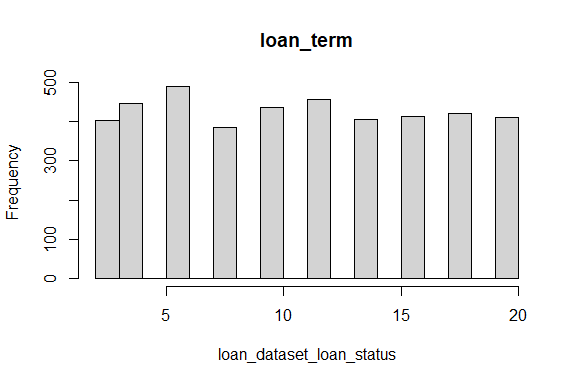
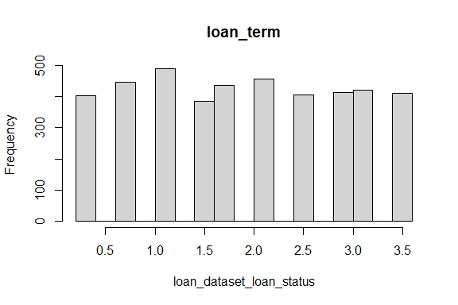

Business Intelligence Project
================
<Ayan Ahmed>
\<17th November\>

- [Student Details](#student-details)

# Student Details

|                       |              |
|-----------------------|--------------|
| **Student ID Number** | 127039 …     |
| **Student Name**      | Ayan Ahmed … |
| **BBIT 4.2 Group**    | .C..         |

\#load dataset

``` r
library(readr)
loan_dataset <- read_csv("Data/loan_dataset.csv")
```

    ## Rows: 4269 Columns: 13
    ## ── Column specification ────────────────────────────────────────────────────────
    ## Delimiter: ","
    ## chr  (3): education, self_employed, loan_status
    ## dbl (10): loan_id, no_of_dependents, income_annum, loan_amount, loan_term, c...
    ## 
    ## ℹ Use `spec()` to retrieve the full column specification for this data.
    ## ℹ Specify the column types or set `show_col_types = FALSE` to quiet this message.

``` r
View(loan_dataset)
```

\#install packages

``` r
if (!is.element("languageserver", installed.packages()[, 1])) {
  install.packages("languageserver", dependencies = TRUE,
                   repos = "https://cloud.r-project.org")
}
require("languageserver")
```

    ## Loading required package: languageserver

``` r
if (!is.element("NHANES", installed.packages()[, 1])) {
  install.packages("NHANES", dependencies = TRUE,
                   repos = "https://cloud.r-project.org")
}
require("NHANES")
```

    ## Loading required package: NHANES

    ## Warning: package 'NHANES' was built under R version 4.3.2

``` r
## dplyr ----
if (!is.element("dplyr", installed.packages()[, 1])) {
  install.packages("dplyr", dependencies = TRUE,
                   repos = "https://cloud.r-project.org")
}
require("dplyr")
```

    ## Loading required package: dplyr

    ## 
    ## Attaching package: 'dplyr'

    ## The following objects are masked from 'package:stats':
    ## 
    ##     filter, lag

    ## The following objects are masked from 'package:base':
    ## 
    ##     intersect, setdiff, setequal, union

``` r
if (!is.element("naniar", installed.packages()[, 1])) {
  install.packages("naniar", dependencies = TRUE,
                   repos = "https://cloud.r-project.org")
}
require("naniar")
```

    ## Loading required package: naniar

    ## Warning: package 'naniar' was built under R version 4.3.2

\#create subset variable

``` r
loan_dataset <- loan_dataset %>%
  select(loan_id, education, loan_amount, loan_term, self_employed, income_annum, cibil_score,
         no_of_dependents, residential_assets_value, commercial_assets_value, luxury_assets_value, bank_asset_value, loan_status)
```

\#choose random variables to test for missing data

``` r
rand_ind <- sample(seq_len(nrow(loan_dataset)), 4269)
loan_dataset <- loan_dataset[rand_ind, ]
```

\#confirm missing data

``` r
any_na(loan_dataset)
```

    ## [1] FALSE

\#Data transformation-packages

``` r
if (require("mlbench")) {
  require("mlbench")
} else {
  install.packages("mlbench", dependencies = TRUE,
                   repos = "https://cloud.r-project.org")
}
```

    ## Loading required package: mlbench

``` r
## readr ----
if (require("readr")) {
  require("readr")
} else {
  install.packages("readr", dependencies = TRUE,
                   repos = "https://cloud.r-project.org")
}

## e1071 ----
if (require("e1071")) {
  require("e1071")
} else {
  install.packages("e1071", dependencies = TRUE,
                   repos = "https://cloud.r-project.org")
}
```

    ## Loading required package: e1071

``` r
## factoextra ----
if (require("factoextra")) {
  require("factoextra")
} else {
  install.packages("factoextra", dependencies = TRUE,
                   repos = "https://cloud.r-project.org")
}
```

    ## Loading required package: factoextra

    ## Warning: package 'factoextra' was built under R version 4.3.2

    ## Loading required package: ggplot2

    ## Welcome! Want to learn more? See two factoextra-related books at https://goo.gl/ve3WBa

``` r
## FactoMineR ----
if (require("FactoMineR")) {
  require("FactoMineR")
} else {
  install.packages("FactoMineR", dependencies = TRUE,
                   repos = "https://cloud.r-project.org")
}
```

    ## Loading required package: FactoMineR

    ## Warning: package 'FactoMineR' was built under R version 4.3.2

\#data before sacle basic data transformation

``` r
if (!is.element("caret", installed.packages()[, 1])) {
  install.packages("caret", dependencies = TRUE)
}
require("caret")
```

    ## Loading required package: caret

    ## Loading required package: lattice

``` r
summary(loan_dataset)
```

    ##     loan_id      education          loan_amount         loan_term   
    ##  Min.   :   1   Length:4269        Min.   :  300000   Min.   : 2.0  
    ##  1st Qu.:1068   Class :character   1st Qu.: 7700000   1st Qu.: 6.0  
    ##  Median :2135   Mode  :character   Median :14500000   Median :10.0  
    ##  Mean   :2135                      Mean   :15133450   Mean   :10.9  
    ##  3rd Qu.:3202                      3rd Qu.:21500000   3rd Qu.:16.0  
    ##  Max.   :4269                      Max.   :39500000   Max.   :20.0  
    ##  self_employed       income_annum      cibil_score    no_of_dependents
    ##  Length:4269        Min.   : 200000   Min.   :300.0   Min.   :0.000   
    ##  Class :character   1st Qu.:2700000   1st Qu.:453.0   1st Qu.:1.000   
    ##  Mode  :character   Median :5100000   Median :600.0   Median :3.000   
    ##                     Mean   :5059124   Mean   :599.9   Mean   :2.499   
    ##                     3rd Qu.:7500000   3rd Qu.:748.0   3rd Qu.:4.000   
    ##                     Max.   :9900000   Max.   :900.0   Max.   :5.000   
    ##  residential_assets_value commercial_assets_value luxury_assets_value
    ##  Min.   : -100000         Min.   :       0        Min.   :  300000   
    ##  1st Qu.: 2200000         1st Qu.: 1300000        1st Qu.: 7500000   
    ##  Median : 5600000         Median : 3700000        Median :14600000   
    ##  Mean   : 7472617         Mean   : 4973155        Mean   :15126306   
    ##  3rd Qu.:11300000         3rd Qu.: 7600000        3rd Qu.:21700000   
    ##  Max.   :29100000         Max.   :19400000        Max.   :39200000   
    ##  bank_asset_value   loan_status       
    ##  Min.   :       0   Length:4269       
    ##  1st Qu.: 2300000   Class :character  
    ##  Median : 4600000   Mode  :character  
    ##  Mean   : 4976692                     
    ##  3rd Qu.: 7100000                     
    ##  Max.   :14700000

``` r
loan_dataset_loan_status <- as.numeric(unlist(loan_dataset[, 4]))
hist(loan_dataset_loan_status, main = names(loan_dataset)[4])
```

<!-- -->

``` r
model_of_the_transform <- preProcess(loan_dataset, method = c("scale"))
print(model_of_the_transform)
```

    ## Created from 4269 samples and 13 variables
    ## 
    ## Pre-processing:
    ##   - ignored (3)
    ##   - scaled (10)

``` r
loan_dataset_scale_transform <- predict(model_of_the_transform, loan_dataset)
```

\#data after scale basic data transformation

``` r
summary(loan_dataset_scale_transform)
```

    ##     loan_id          education          loan_amount        loan_term     
    ##  Min.   :0.000811   Length:4269        Min.   :0.03317   Min.   :0.3503  
    ##  1st Qu.:0.866533   Class :character   1st Qu.:0.85145   1st Qu.:1.0509  
    ##  Median :1.732254   Mode  :character   Median :1.60339   Median :1.7516  
    ##  Mean   :1.732254                      Mean   :1.67343   Mean   :1.9093  
    ##  3rd Qu.:2.597975                      3rd Qu.:2.37743   3rd Qu.:2.8025  
    ##  Max.   :3.463696                      Max.   :4.36784   Max.   :3.5031  
    ##  self_employed       income_annum      cibil_score    no_of_dependents
    ##  Length:4269        Min.   :0.07125   Min.   :1.740   Min.   :0.0000  
    ##  Class :character   1st Qu.:0.96194   1st Qu.:2.627   1st Qu.:0.5897  
    ##  Mode  :character   Median :1.81699   Median :3.480   Median :1.7690  
    ##                     Mean   :1.80243   Mean   :3.479   Mean   :1.4734  
    ##                     3rd Qu.:2.67204   3rd Qu.:4.338   3rd Qu.:2.3586  
    ##                     Max.   :3.52710   Max.   :5.219   Max.   :2.9483  
    ##  residential_assets_value commercial_assets_value luxury_assets_value
    ##  Min.   :-0.01538         Min.   :0.0000          Min.   :0.03295    
    ##  1st Qu.: 0.33827         1st Qu.:0.2962          1st Qu.:0.82384    
    ##  Median : 0.86106         Median :0.8430          Median :1.60373    
    ##  Mean   : 1.14899         Mean   :1.1331          Mean   :1.66155    
    ##  3rd Qu.: 1.73749         3rd Qu.:1.7316          3rd Qu.:2.38363    
    ##  Max.   : 4.47442         Max.   :4.4202          Max.   :4.30592    
    ##  bank_asset_value loan_status       
    ##  Min.   :0.0000   Length:4269       
    ##  1st Qu.:0.7077   Class :character  
    ##  Median :1.4153   Mode  :character  
    ##  Mean   :1.5312                     
    ##  3rd Qu.:2.1845                     
    ##  Max.   :4.5228

``` r
loan_dataset_loan_status <- as.numeric(unlist(loan_dataset_scale_transform[, 4]))
hist(loan_dataset_loan_status, main = names(loan_dataset_scale_transform)[4])
```

<!-- -->
