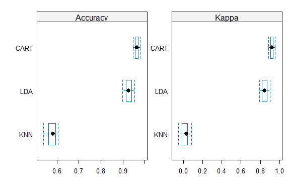

Business Intelligence Project
================
<Ayan Ahmed>
\<17th November\>

- [Student Details](#student-details)

# Student Details

|                       |              |
|-----------------------|--------------|
| **Student ID Number** | 127039 …     |
| **Student Name**      | Ayan Ahmed … |
| **BBIT 4.2 Group**    | .C..         |

\#load dataset

``` r
library(readr)
loan_dataset <- read_csv("Data/loan_dataset.csv")
```

    ## Rows: 4269 Columns: 13
    ## ── Column specification ────────────────────────────────────────────────────────
    ## Delimiter: ","
    ## chr  (3): education, self_employed, loan_status
    ## dbl (10): loan_id, no_of_dependents, income_annum, loan_amount, loan_term, c...
    ## 
    ## ℹ Use `spec()` to retrieve the full column specification for this data.
    ## ℹ Specify the column types or set `show_col_types = FALSE` to quiet this message.

``` r
View(loan_dataset)
```

\#install packages

``` r
if (require("pROC")) {
  require("pROC")
} else {
  install.packages("pROC", dependencies = TRUE,
                   repos = "https://cloud.r-project.org")
}
```

    ## Loading required package: pROC

    ## Type 'citation("pROC")' for a citation.

    ## 
    ## Attaching package: 'pROC'

    ## The following objects are masked from 'package:stats':
    ## 
    ##     cov, smooth, var

``` r
## dplyr ----
if (require("dplyr")) {
  require("dplyr")
} else {
  install.packages("dplyr", dependencies = TRUE,
                   repos = "https://cloud.r-project.org")
}
```

    ## Loading required package: dplyr

    ## 
    ## Attaching package: 'dplyr'

    ## The following objects are masked from 'package:stats':
    ## 
    ##     filter, lag

    ## The following objects are masked from 'package:base':
    ## 
    ##     intersect, setdiff, setequal, union

\#check data frequency

``` r
loan_dataset_freq <- loan_dataset$loan_status
cbind(frequency =
        table(loan_dataset_freq),
      percentage = prop.table(table(loan_dataset_freq)) * 100)
```

    ##          frequency percentage
    ## Approved      2656   62.21598
    ## Rejected      1613   37.78402

\#split the data

``` r
if (!is.element("caret", installed.packages()[, 1])) {
  install.packages("caret", dependencies = TRUE)
}
require("caret")
```

    ## Loading required package: caret

    ## Loading required package: ggplot2

    ## Loading required package: lattice

``` r
train_index <- createDataPartition(loan_dataset$loan_status,
                                   p = 0.75,
                                   list = FALSE)
loan_dataset_train <- loan_dataset[train_index, ]
loan_dataset_test <- loan_dataset[-train_index, ]
```

\#train the model

``` r
train_control <- trainControl(method = "cv", number = 13)
```

\#accuracy and kappa

``` r
set.seed(7)
loan_dataset_model_glm <-
  train(loan_status ~ ., data = loan_dataset_train, method = "glm",
        metric = "Accuracy", trControl = train_control)
```

\#print model performance

``` r
print(loan_dataset_model_glm)
```

    ## Generalized Linear Model 
    ## 
    ## 3202 samples
    ##   12 predictor
    ##    2 classes: 'Approved', 'Rejected' 
    ## 
    ## No pre-processing
    ## Resampling: Cross-Validated (13 fold) 
    ## Summary of sample sizes: 2956, 2955, 2954, 2956, 2955, 2956, ... 
    ## Resampling results:
    ## 
    ##   Accuracy   Kappa    
    ##   0.9131856  0.8153771

\#applying 5-fold cross validation resampling method

``` r
train_control <- trainControl(method = "cv", number = 13)
loan_dataset_caret_model_rpart <- train(loan_status ~ ., data = loan_dataset,
                                    method = "rpart", metric = "Accuracy",
                                    trControl = train_control)
```

\#print the model

``` r
print(loan_dataset_caret_model_rpart)
```

    ## CART 
    ## 
    ## 4269 samples
    ##   12 predictor
    ##    2 classes: 'Approved', 'Rejected' 
    ## 
    ## No pre-processing
    ## Resampling: Cross-Validated (13 fold) 
    ## Summary of sample sizes: 3941, 3941, 3941, 3941, 3940, 3941, ... 
    ## Resampling results across tuning parameters:
    ## 
    ##   cp          Accuracy   Kappa    
    ##   0.01177929  0.9613488  0.9179467
    ##   0.01394916  0.9522089  0.8997485
    ##   0.87724737  0.7955542  0.4762886
    ## 
    ## Accuracy was used to select the optimal model using the largest value.
    ## The final value used for the model was cp = 0.01177929.

\#predictions

``` r
predictions <- predict(loan_dataset_caret_model_rpart,
                       loan_dataset_test[, 1:13],
                       type = "raw")
```

\#model performance

``` r
table(predictions, loan_dataset_test$loan_status)
```

    ##            
    ## predictions Approved Rejected
    ##    Approved      634        4
    ##    Rejected       30      399

\#comparing model performance - LDA,CART ,KNN

``` r
train_control <- trainControl(method = "repeatedcv", number = 10, repeats = 3)
```

\#LDA

``` r
set.seed(7)
loan_dataset_model_lda <- train(loan_status ~ ., data = loan_dataset,
                            method = "lda", trControl = train_control)
```

\#CART

``` r
set.seed(7)
loan_dataset_model_cart <- train(loan_status ~ ., data = loan_dataset,
                             method = "rpart", trControl = train_control)
```

\#KNN

``` r
set.seed(7)
loan_dataset_model_knn <- train(loan_status ~ ., data = loan_dataset,
                            method = "knn", trControl = train_control)
```

\#call resamples functions

``` r
results <- resamples(list(LDA = loan_dataset_model_lda, CART = loan_dataset_model_cart,
                          KNN = loan_dataset_model_knn))
```

\#results of the resample functions

``` r
summary(results)
```

    ## 
    ## Call:
    ## summary.resamples(object = results)
    ## 
    ## Models: LDA, CART, KNN 
    ## Number of resamples: 30 
    ## 
    ## Accuracy 
    ##           Min.   1st Qu.    Median      Mean   3rd Qu.      Max. NA's
    ## LDA  0.8992974 0.9140863 0.9261443 0.9258262 0.9379391 0.9530516    0
    ## CART 0.9462617 0.9555035 0.9648300 0.9629910 0.9695372 0.9789227    0
    ## KNN  0.5386417 0.5623907 0.5819672 0.5765562 0.5916799 0.6042155    0
    ## 
    ## Kappa 
    ##             Min.     1st Qu.     Median       Mean    3rd Qu.       Max. NA's
    ## LDA   0.79051194  0.82028532 0.84603157 0.84455057 0.86890084 0.90015235    0
    ## CART  0.88807531  0.90602323 0.92487331 0.92132012 0.93427843 0.95463185    0
    ## KNN  -0.05034525 -0.01124975 0.03322478 0.01946604 0.04506238 0.08480503    0

\#box plot of the results

``` r
scales <- list(x = list(relation = "free"), y = list(relation = "free"))
bwplot(results, scales = scales)
```

<!-- -->
