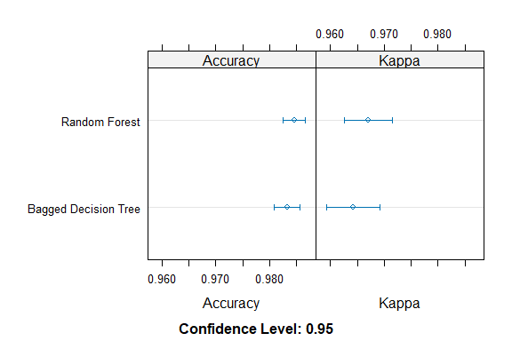

Business Intelligence Project
================
<Ayan Ahmed>
\<17th November\>

- [Student Details](#student-details)

# Student Details

|                       |              |
|-----------------------|--------------|
| **Student ID Number** | 127039 …     |
| **Student Name**      | Ayan Ahmed … |
| **BBIT 4.2 Group**    | .C..         |

\#load dataset

``` r
library(readr)
loan_dataset <- read_csv("Data/loan_dataset.csv")
```

    ## Rows: 4269 Columns: 13
    ## ── Column specification ────────────────────────────────────────────────────────
    ## Delimiter: ","
    ## chr  (3): education, self_employed, loan_status
    ## dbl (10): loan_id, no_of_dependents, income_annum, loan_amount, loan_term, c...
    ## 
    ## ℹ Use `spec()` to retrieve the full column specification for this data.
    ## ℹ Specify the column types or set `show_col_types = FALSE` to quiet this message.

``` r
View(loan_dataset)
```

\#install packages

``` r
## mlbench ----
if (require("mlbench")) {
  require("mlbench")
} else {
  install.packages("mlbench", dependencies = TRUE,
                   repos = "https://cloud.r-project.org")
}
```

    ## Loading required package: mlbench

``` r
## caret ----
if (require("caret")) {
  require("caret")
} else {
  install.packages("caret", dependencies = TRUE,
                   repos = "https://cloud.r-project.org")
}
```

    ## Loading required package: caret

    ## Loading required package: ggplot2

    ## Loading required package: lattice

``` r
## caretEnsemble ----
if (require("caretEnsemble")) {
  require("caretEnsemble")
} else {
  install.packages("caretEnsemble", dependencies = TRUE,
                   repos = "https://cloud.r-project.org")
}
```

    ## Loading required package: caretEnsemble

    ## Warning in library(package, lib.loc = lib.loc, character.only = TRUE,
    ## logical.return = TRUE, : there is no package called 'caretEnsemble'

    ## Installing package into 'C:/Users/ayern/OneDrive/Desktop/127039-BI PROJECT/Markdown/renv/library/R-4.3/x86_64-w64-mingw32'
    ## (as 'lib' is unspecified)

    ## also installing the dependencies 'xtable', 'sourcetools', 'shiny', 'miniUI', 'classInt', 'credentials', 'zip', 'gitcreds', 'httr2', 'ini', 'bitops', 'combinat', 'questionr', 'gert', 'gh', 'whisker', 'pbapply', 'caTools', 'kernlab', 'gbm', 'klaR', 'usethis'

    ## package 'xtable' successfully unpacked and MD5 sums checked
    ## package 'sourcetools' successfully unpacked and MD5 sums checked
    ## package 'shiny' successfully unpacked and MD5 sums checked
    ## package 'miniUI' successfully unpacked and MD5 sums checked
    ## package 'classInt' successfully unpacked and MD5 sums checked
    ## package 'credentials' successfully unpacked and MD5 sums checked
    ## package 'zip' successfully unpacked and MD5 sums checked
    ## package 'gitcreds' successfully unpacked and MD5 sums checked
    ## package 'httr2' successfully unpacked and MD5 sums checked
    ## package 'ini' successfully unpacked and MD5 sums checked
    ## package 'bitops' successfully unpacked and MD5 sums checked
    ## package 'combinat' successfully unpacked and MD5 sums checked
    ## package 'questionr' successfully unpacked and MD5 sums checked
    ## package 'gert' successfully unpacked and MD5 sums checked
    ## package 'gh' successfully unpacked and MD5 sums checked
    ## package 'whisker' successfully unpacked and MD5 sums checked
    ## package 'pbapply' successfully unpacked and MD5 sums checked
    ## package 'caTools' successfully unpacked and MD5 sums checked
    ## package 'kernlab' successfully unpacked and MD5 sums checked
    ## package 'gbm' successfully unpacked and MD5 sums checked
    ## package 'klaR' successfully unpacked and MD5 sums checked
    ## package 'usethis' successfully unpacked and MD5 sums checked
    ## package 'caretEnsemble' successfully unpacked and MD5 sums checked
    ## 
    ## The downloaded binary packages are in
    ##  C:\Users\ayern\AppData\Local\Temp\RtmpyMcC8F\downloaded_packages

``` r
## C50 ----
if (require("C50")) {
  require("C50")
} else {
  install.packages("C50", dependencies = TRUE,
                   repos = "https://cloud.r-project.org")
}
```

    ## Loading required package: C50

    ## Warning in library(package, lib.loc = lib.loc, character.only = TRUE,
    ## logical.return = TRUE, : there is no package called 'C50'

    ## Installing package into 'C:/Users/ayern/OneDrive/Desktop/127039-BI PROJECT/Markdown/renv/library/R-4.3/x86_64-w64-mingw32'
    ## (as 'lib' is unspecified)

    ## also installing the dependencies 'libcoin', 'inum', 'Cubist', 'partykit', 'modeldata'

    ## package 'libcoin' successfully unpacked and MD5 sums checked
    ## package 'inum' successfully unpacked and MD5 sums checked
    ## package 'Cubist' successfully unpacked and MD5 sums checked
    ## package 'partykit' successfully unpacked and MD5 sums checked
    ## package 'modeldata' successfully unpacked and MD5 sums checked
    ## package 'C50' successfully unpacked and MD5 sums checked
    ## 
    ## The downloaded binary packages are in
    ##  C:\Users\ayern\AppData\Local\Temp\RtmpyMcC8F\downloaded_packages

``` r
## adabag ----
if (require("adabag")) {
  require("adabag")
} else {
  install.packages("adabag", dependencies = TRUE,
                   repos = "https://cloud.r-project.org")
}
```

    ## Loading required package: adabag

    ## Warning in library(package, lib.loc = lib.loc, character.only = TRUE,
    ## logical.return = TRUE, : there is no package called 'adabag'

    ## Installing package into 'C:/Users/ayern/OneDrive/Desktop/127039-BI PROJECT/Markdown/renv/library/R-4.3/x86_64-w64-mingw32'
    ## (as 'lib' is unspecified)

    ## also installing the dependencies 'XML', 'rgl', 'rlist', 'gtools', 'doParallel', 'ConsRank'

    ## package 'XML' successfully unpacked and MD5 sums checked
    ## package 'rgl' successfully unpacked and MD5 sums checked
    ## package 'rlist' successfully unpacked and MD5 sums checked
    ## package 'gtools' successfully unpacked and MD5 sums checked
    ## package 'doParallel' successfully unpacked and MD5 sums checked
    ## package 'ConsRank' successfully unpacked and MD5 sums checked
    ## package 'adabag' successfully unpacked and MD5 sums checked
    ## 
    ## The downloaded binary packages are in
    ##  C:\Users\ayern\AppData\Local\Temp\RtmpyMcC8F\downloaded_packages

\#Baggging ensemble method

``` r
train_control <- trainControl(method = "repeatedcv", number = 10, repeats = 3)
seed <- 7
metric <- "Accuracy"
```

\#1.Bagged CART

``` r
set.seed(seed)
loan_dataset_model_bagged_cart <- train(loan_status ~ ., data = loan_dataset, method = "treebag",
                               metric = metric,
                               trControl = train_control)
```

\#2.Random Forest

``` r
set.seed(seed)
loan_dataset_model_rf <- train(loan_status ~ ., data = loan_dataset, method = "rf",
                      metric = metric, trControl = train_control)
```

\#summary results of each algorithm

``` r
bagging_results <-
  resamples(list("Bagged Decision Tree" = loan_dataset_model_bagged_cart,
                 "Random Forest" = loan_dataset_model_rf))
```

\#total summary results of bagging

``` r
summary(bagging_results)
```

    ## 
    ## Call:
    ## summary.resamples(object = bagging_results)
    ## 
    ## Models: Bagged Decision Tree, Random Forest 
    ## Number of resamples: 30 
    ## 
    ## Accuracy 
    ##                          Min.   1st Qu.    Median      Mean   3rd Qu.      Max.
    ## Bagged Decision Tree 0.971897 0.9788732 0.9824164 0.9832114 0.9882904 0.9953162
    ## Random Forest        0.969555 0.9812317 0.9859155 0.9845385 0.9882904 0.9953162
    ##                      NA's
    ## Bagged Decision Tree    0
    ## Random Forest           0
    ## 
    ## Kappa 
    ##                           Min.   1st Qu.    Median      Mean   3rd Qu.
    ## Bagged Decision Tree 0.9398888 0.9547531 0.9625702 0.9642194 0.9749815
    ## Random Forest        0.9351117 0.9598547 0.9699409 0.9670091 0.9749815
    ##                           Max. NA's
    ## Bagged Decision Tree 0.9900536    0
    ## Random Forest        0.9900536    0

\#plot of the summary

``` r
dotplot(bagging_results)
```

<!-- -->
